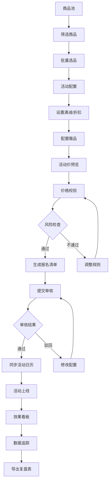

## 1. 产品概述
电商运营平台 Web 应用，为中小网店运营人员提供一站式促销活动管理解决方案。帮助运营人员高效管理商品、配置活动、校验价格风险、追踪活动效果，提升促销活动的转化率和盈利能力。

## 2. 核心功能

### 2.1 用户角色
| 角色 | 注册方式 | 核心权限 |
|------|----------|----------|
| 运营人员 | 店铺授权登录 | 商品管理、活动配置、价格校验、数据看板 |

### 2.2 功能模块
1. **商品池页面**：商品导入、库存/毛利筛选、选品管理、店铺分类
2. **活动配置页面**：满减折扣设置、赠品配置、活动价预览、报名清单生成、审核状态管理、活动日历同步
3. **价格校验页面**：成本价检查、叠券风险预警、批量校验、风险报告
4. **效果看板页面**：成交额统计、转化率分析、活动前后数据对比、复盘表导出

### 2.3 页面详情
| 页面名称 | 模块名称 | 功能描述 |
|-----------|-------------|---------------------|
| 商品池 | 商品列表 | 展示商品信息（名称、SKU、库存、成本价、售价、毛利） |
| 商品池 | 导入功能 | 按店铺批量导入商品，支持 CSV/Excel 格式 |
| 商品池 | 筛选功能 | 按库存范围、毛利区间、分类、店铺筛选商品 |
| 商品池 | 选品功能 | 批量选择商品加入活动，一键加入活动配置 |
| 活动配置 | 活动信息 | 活动名称、时间范围、活动类型选择 |
| 活动配置 | 促销规则 | 满减设置（满X减Y）、折扣设置、多阶梯优惠 |
| 活动配置 | 赠品管理 | 赠品选择、赠送条件设置、库存限制 |
| 活动配置 | 价格预览 | 实时计算活动价格，展示优惠力度 |
| 活动配置 | 报名清单 | 生成活动报名商品清单，支持导出 |
| 活动配置 | 审核管理 | 记录审核状态（待审核、已通过、已驳回），审核意见 |
| 活动配置 | 活动日历 | 同步活动时间到日历视图，查看活动排期 |
| 价格校验 | 成本检查 | 批量检查活动价是否低于成本价，标记风险商品 |
| 价格校验 | 叠券风险 | 检测优惠券叠加后的最终价格，预警亏损风险 |
| 价格校验 | 风险报告 | 生成风险评估报告，按风险等级分类展示 |
| 效果看板 | 核心指标 | 成交金额、订单数、转化率、客单价实时展示 |
| 效果看板 | 趋势图表 | 成交额趋势、转化率趋势、按日/周/月维度 |
| 效果看板 | 数据对比 | 活动前 vs 活动后数据对比，环比同比分析 |
| 效果看板 | 商品排行 | 热销商品排行、毛利贡献排行 |
| 效果看板 | 复盘导出 | 导出活动复盘数据表，支持 Excel 格式 |

## 3. 核心流程
用户从商品池选品，进入活动配置页面设置促销规则，经过价格校验确认无风险后提交审核，活动上线后在效果看板追踪数据，最终导出复盘报告。

## 4. 用户界面设计

### 4.1 设计风格
- **主色调**：深蓝色 `#1e3a5f`（专业、可信赖）
- **辅助色**：橙色 `#f59e0b`（促销、活力），绿色 `#10b981`（通过、正常），红色 `#ef4444`（警告、风险）
- **中性色**：以 slate 色系为基础，保持清晰的层级关系
- **按钮风格**：圆角 6px，hover 时有轻微上移和阴影变化，主按钮采用渐变效果
- **字体**：标题使用 "Noto Sans SC"，正文使用 "Inter"，保持中文可读性和现代感
- **布局风格**：侧边导航 + 顶部操作栏 + 内容区卡片式布局，信息密度适中
- **图标**：使用 lucide-react 图标库，保持线性风格统一

### 4.2 页面设计概述
| 页面名称 | 模块名称 | UI 元素 |
|-----------|-------------|-------------|
| 商品池 | 顶部操作区 | 店铺选择器、导入按钮、高级筛选面板、搜索框 |
| 商品池 | 商品表格 | 可滚动数据表格，支持多选、列排序、分页 |
| 商品池 | 底部操作栏 | 已选商品计数、批量加入活动按钮 |
| 活动配置 | 步骤导航 | 活动信息 → 促销规则 → 赠品配置 → 预览提交 |
| 活动配置 | 规则编辑器 | 可添加多阶梯满减规则，动态表单 |
| 活动配置 | 商品清单 | 已选商品列表，展示原价/活动价/优惠力度 |
| 活动配置 | 活动日历 | 月视图日历，标记活动时间段 |
| 价格校验 | 风险仪表盘 | 风险等级统计卡片，进度条展示 |
| 价格校验 | 风险列表 | 按严重程度分组，展开查看详情和建议 |
| 价格校验 | 校验结果 | 校验通过/失败状态展示，一键修复建议 |
| 效果看板 | 核心指标卡 | 大数字展示，带环比增减箭头和百分比 |
| 效果看板 | 趋势图表 | 面积图展示成交额趋势，柱状图对比 |
| 效果看板 | 对比分析 | 活动前后数据并列展示，差异高亮 |
| 效果看板 | 商品排行 | 带排名的列表，支持按不同指标排序 |

### 4.3 响应式
- **桌面优先**：设计面向 1280px 及以上宽屏，侧边导航固定宽度 240px
- **平板适配**：1024px 时侧边栏可收起，表格支持横向滚动
- **移动优化**：768px 以下转为顶部 tabs 导航，卡片堆叠展示
- **触控优化**：按钮最小高度 44px，表格行高适配触控操作

### 4.4 动效设计
- **页面加载**：内容区渐入 + 轻微上移，卡片依次延迟出现
- **状态切换**：Tab 切换使用淡入淡出，表格数据刷新使用骨架屏过渡
- **交互反馈**：按钮点击有缩放效果，表单验证错误有抖动提示
- **数据变化**：数字更新有滚动动画，指标卡片环比变化有颜色过渡
- **风险提示**：高风险项目有脉冲动画吸引注意力
