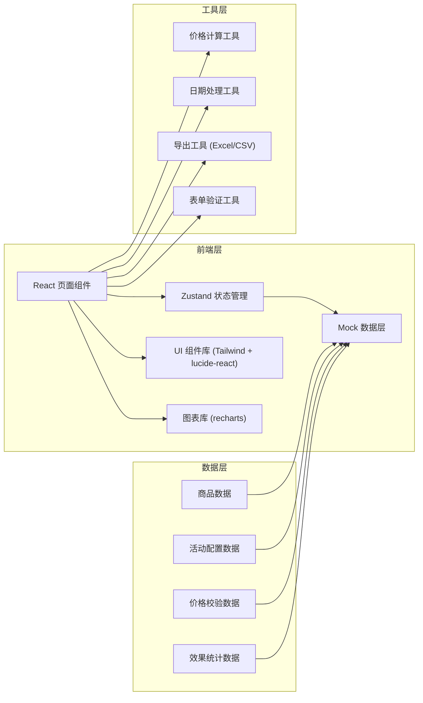

## 1. 架构设计



## 2. 技术描述

- **前端框架**：React@18 + TypeScript@5
- **构建工具**：Vite@5
- **样式方案**：TailwindCSS@3
- **状态管理**：Zustand@4
- **路由管理**：react-router-dom@6
- **图表库**：recharts@2
- **图标库**：lucide-react@0.344
- **数据处理**：纯前端 Mock 数据，使用 TypeScript 类型定义
- **导出功能**：xlsx (Excel 导出)

## 3. 路由定义

| 路由 | 页面 | 用途 |
|-------|------|------|
| /products | 商品池页面 | 商品导入、筛选、选品 |
| /campaigns | 活动配置页面 | 活动列表、活动创建与编辑 |
| /campaigns/new | 活动配置页面 | 新建活动向导 |
| /campaigns/:id | 活动配置页面 | 编辑指定活动 |
| /price-check | 价格校验页面 | 价格风险检查、叠券检测 |
| /dashboard | 效果看板页面 | 数据统计、趋势分析、复盘导出 |

## 4. 数据类型定义

```typescript
// 商品类型
interface Product {
  id: string;
  sku: string;
  name: string;
  category: string;
  shopId: string;
  shopName: string;
  stock: number;
  costPrice: number;
  salePrice: number;
  grossMargin: number;
  imageUrl: string;
  createdAt: string;
}

// 店铺类型
interface Shop {
  id: string;
  name: string;
  platform: 'taobao' | 'jd' | 'pdd' | 'douyin';
  status: 'active' | 'inactive';
}

// 促销规则类型
interface PromotionRule {
  id: string;
  type: 'discount' | 'fullReduce' | 'gift';
  condition: {
    minAmount?: number;
    minQuantity?: number;
  };
  benefit: {
    discountRate?: number;
    reduceAmount?: number;
    giftProductId?: string;
    giftQuantity?: number;
  };
}

// 活动类型
interface Campaign {
  id: string;
  name: string;
  type: string;
  status: 'draft' | 'pending' | 'approved' | 'rejected' | 'active' | 'ended';
  startTime: string;
  endTime: string;
  productIds: string[];
  rules: PromotionRule[];
  reviewComment?: string;
  createdAt: string;
  updatedAt: string;
}

// 价格校验结果
interface PriceCheckResult {
  productId: string;
  productName: string;
  originalPrice: number;
  activityPrice: number;
  costPrice: number;
  belowCost: boolean;
  couponStackRisk: boolean;
  finalPriceWithCoupons: number;
  riskLevel: 'high' | 'medium' | 'low';
  suggestions: string[];
}

// 效果统计数据
interface DashboardStats {
  totalSales: number;
  orderCount: number;
  conversionRate: number;
  avgOrderValue: number;
  comparedToPrevious: {
    sales: number;
    orders: number;
    conversion: number;
    avgOrder: number;
  };
}

// 每日趋势数据
interface DailyTrend {
  date: string;
  sales: number;
  orders: number;
  visitors: number;
  conversionRate: number;
}

// 商品排行数据
interface ProductRanking {
  productId: string;
  productName: string;
  sales: number;
  quantity: number;
  grossProfit: number;
  rank: number;
}
```

## 5. 状态管理结构

```typescript
// Zustand Store 结构
interface AppState {
  // 商品相关
  products: Product[];
  shops: Shop[];
  selectedProductIds: string[];
  filters: ProductFilters;
  
  // 活动相关
  campaigns: Campaign[];
  currentCampaign: Campaign | null;
  
  // 价格校验
  priceCheckResults: PriceCheckResult[];
  
  // 看板数据
  dashboardStats: DashboardStats | null;
  trendData: DailyTrend[];
  rankingData: ProductRanking[];
  
  // Actions
  setProducts: (products: Product[]) => void;
  selectProduct: (id: string) => void;
  deselectProduct: (id: string) => void;
  clearSelection: () => void;
  setFilters: (filters: Partial<ProductFilters>) => void;
  createCampaign: (data: Partial<Campaign>) => void;
  updateCampaign: (id: string, data: Partial<Campaign>) => void;
  runPriceCheck: (productIds: string[], rules: PromotionRule[]) => void;
  loadDashboardData: (campaignId?: string) => void;
}
```

## 6. 项目目录结构

```
src/
├── components/          # 公共组件
│   ├── layout/         # 布局组件 (Sidebar, Header, etc.)
│   ├── ui/             # 基础 UI 组件 (Button, Table, Modal, etc.)
│   └── charts/         # 图表组件
├── pages/              # 页面组件
│   ├── ProductPool/    # 商品池页面
│   ├── CampaignConfig/ # 活动配置页面
│   ├── PriceCheck/     # 价格校验页面
│   └── Dashboard/      # 效果看板页面
├── store/              # Zustand 状态管理
│   └── useStore.ts
├── types/              # TypeScript 类型定义
│   └── index.ts
├── utils/              # 工具函数
│   ├── price.ts        # 价格计算
│   ├── date.ts         # 日期处理
│   ├── export.ts       # 导出功能
│   └── validation.ts   # 表单验证
├── data/               # Mock 数据
│   ├── products.ts
│   ├── campaigns.ts
│   └── dashboard.ts
├── hooks/              # 自定义 Hooks
│   ├── useProducts.ts
│   ├── useCampaign.ts
│   └── useDashboard.ts
├── App.tsx
├── main.tsx
└── index.css
```

## 7. 核心功能模块说明

### 7.1 价格计算引擎
- 支持多阶梯满减计算
- 支持折扣率计算
- 支持赠品成本核算
- 支持优惠券叠加模拟
- 实时计算活动价格和毛利

### 7.2 数据筛选引擎
- 支持多条件组合筛选
- 支持库存范围筛选
- 支持毛利区间筛选
- 支持店铺分类筛选
- 支持搜索模糊匹配

### 7.3 导出功能
- 支持 Excel 格式导出
- 支持 CSV 格式导出
- 支持自定义导出字段
- 支持报名清单模板导出
- 支持复盘数据表导出

### 7.4 图表可视化
- 成交额趋势面积图
- 转化率趋势折线图
- 活动前后对比柱状图
- 商品排行条形图
- 风险等级分布饼图
